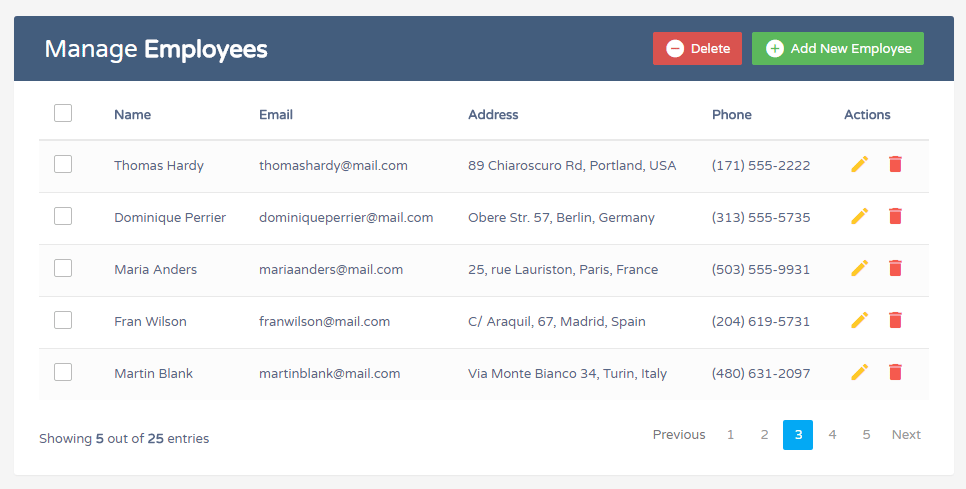

# Test NEST Frontend for IVANJP

Deployed to [vercel](https://code-test-next.vercel.app/)

## Technical Requirements

Show a list of students with the following information:

- First Name
- Last Name
- Email
- Age
- Grade (1st, 2nd, 3rd, etc...)

### Requirements

- The user should be able to add a new student
- The user should be able to edit the an existing student record
- The user should be able to delete a student

- Before a student can be removed, a confirmation dialog should be displayed that asks the user if they really want to delete the student
- Create a mixin for rem font sizes, and apply it to all headings in correct scss partial.
- Create a sass map for defining colors. Use color map to make paragraph tags a color of your choosing.

## API Requirements

Use Express
CRUD for students
MongoDB/MySQL/sqllite

## UI Requirement

- Use CSS Flexbox
- Use no styling libary
- Use React to build the UIui-requirement.png
- Use Redux or Context API
- Use React Hooks

## BIG BONUS

- Unit test any part of the code to show case you can unit test (inline comment explaining what you are testing)
- NextJs
- Context API
